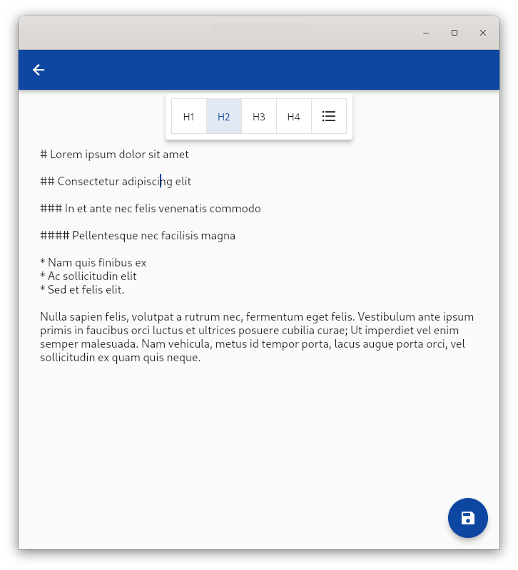

<!--
This README describes the package. If you publish this package to pub.dev,
this README's contents appear on the landing page for your package.

For information about how to write a good package README, see the guide for
[writing package pages](https://dart.dev/guides/libraries/writing-package-pages).

For general information about developing packages, see the Dart guide for
[creating packages](https://dart.dev/guides/libraries/create-library-packages)
and the Flutter guide for
[developing packages and plugins](https://flutter.dev/developing-packages).
-->

# markdown_editor

[](https://github.com/Yiannis128/markdown_editor/actions/workflows/dart.yml)

Flutter library that contains widgets for editing markdown.

## Features

- Editor toolbar with Markdown basic functions.
- Full editor widget with a toolbar.



## Getting started

Import the package using Flutter Pub:

```shell
flutter pub add markdown_editor
```

## Usage

### Editor

The editor is available as a single widget like so:

```dart
  @override
  Widget build(BuildContext context) {
    return Scaffold(
      appBar: AppBar(
        title: const Text("Edit"),
      ),
      floatingActionButton: FloatingActionButton(
        child: const Icon(Icons.save),
        onPressed: () {
          // Save text here...
        },
      ),
      body: MarkdownEditorWidget(
        constantFocus: true,
      ),
    );
  }
```

## Additional information

### Contributing

In order to contribute to the repo, file any issues through GitHub or create a
fork, and then a pull request in order to request new features be added in.
Depending on if the pull request contains desired changes, the pull request may
be accepted or denied. If unsure, please file an issue about it. 

## Planned Features

The following features are planned to be added in due time:

- [ ] Unit tests to make sure features work as intended.
- [ ] Add multi-line editing.
- [ ] Numbered list support.
- [ ] Bold, Italic, Underline, Strike-through
- [ ] Horizontal rule

The following items maybe added in the future, however, are not being worked on:

- [ ] UI tests to make sure UI works as intended.
- [ ] Fancy-view: Inserted markers in text view appear to preview them.
- [ ] Fancy-view: Images appear underneath image declaration in text.
- [ ] Hide Markdown Mode
- [ ] Hide Markdown Mode: Inline image view
- [ ] Extendable editor engine interface: Add the ability to endlessly customize the
editor as required. This includes, easily extendable custom toolbar actions, Hide
Markdown Mode custom rendering, and Fancy-view custom rendering.

